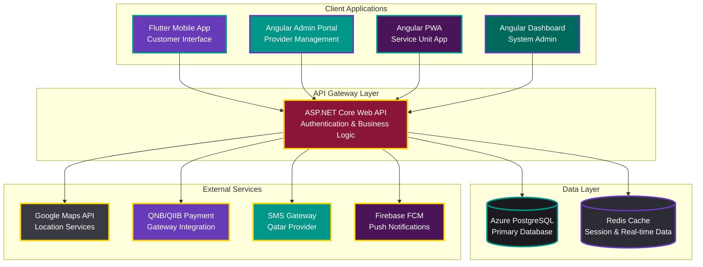

  <h1>🚗 Qatar Car Wash Aggregator Platform</h1>
  <h2>Product Requirements Document (PRD)</h2>
  

    Version 2.0
    September 18, 2025
    Ready for Development
  

---

## 📋 Table of Contents

1. [Executive Summary](#executive-summary)
2. [Business Objectives & Context](#business-objectives--context)
3. [Technical Architecture](#technical-architecture)
4. [Development Milestones](#development-milestones)
5. [Functional Requirements](#functional-requirements)
6. [Non-Functional Requirements](#non-functional-requirements)
7. [User Interface Design Goals](#user-interface-design-goals)
8. [Epic Structure & User Stories](#epic-structure--user-stories)
9. [Success Metrics & KPIs](#success-metrics--kpis)
10. [Risk Assessment](#risk-assessment)
11. [Cultural Integration Requirements](#cultural-integration-requirements)
12. [Compliance & Legal Considerations](#compliance--legal-considerations)

---

## 🎯 Executive Summary

### Product Vision
Develop Qatar's leading car wash service aggregator platform that connects customers with professional car wash vendors, providing convenient on-location vehicle cleaning services through a comprehensive four-platform ecosystem designed specifically for the Qatar market.

### Business Objectives
- **Primary Market**: Qatar (with strategic expansion to GCC countries)
- **Target Scale**: 30-100 transactions/day initially, scaling to 100-200 transactions/day within 12 months
- **Revenue Model**: Commission-based (5-10%) with potential subscription tiers for premium providers
- **Competitive Position**: Compete with 2 existing operators through superior user experience, cultural integration, and comprehensive vendor network
- **Market Entry Strategy**: MVP-first approach with 6-month development timeline using part-time team and AI-assisted workflows

### Platform Ecosystem
Four interconnected applications serving different user segments:
- **Customer Mobile App** (Flutter) - Primary booking and service interface
- **Provider Admin Portal** (Angular Web) - Business management and booking oversight
- **Service Unit App** (Angular PWA) - On-road service team coordination
- **System Admin Dashboard** (Angular Web) - Platform operations and monitoring

### Key Value Propositions

#### For Customers
- On-demand car wash services at preferred locations with real-time tracking
- Transparent pricing with multiple local payment options (QNB, QIIB, digital wallets)
- Quality assurance through verified provider network and rating system
- Cultural timing integration respecting prayer schedules and local preferences

#### For Providers
- Expanded customer base through digital marketplace presence
- Efficient booking management with route optimization tools
- Secure payment processing with regular automated payouts
- Business analytics and performance insights for growth optimization

---

## 🏢 Business Objectives & Context

### Market Analysis
Qatar residents currently face significant challenges accessing convenient, reliable car wash services due to market fragmentation and lack of digital booking solutions. The existing landscape forces customers to rely on word-of-mouth recommendations or physical searching, while service providers struggle with customer acquisition and efficient scheduling.

The project emerges from extensive brainstorming analysis identifying Qatar's unique market dynamics - rapidly changing local demands requiring feedback-driven development approaches rather than static global platform models.

### Competitive Landscape
- **Direct Competitors**: 2 existing car wash aggregator platforms in Qatar market
- **Competitive Advantages**: Cultural integration, Arabic RTL support, local payment gateways, prayer time scheduling
- **Market Differentiation**: Dual service model (standard + custom packages), comprehensive vendor verification, real-time GPS tracking

### Business Success Criteria
- **Transaction Volume**: 30-100 daily transactions (Phase 1), scaling to 100-200 (Phase 2)
- **Customer Retention**: >60% monthly retention rate
- **Provider Satisfaction**: >4.0/5.0 rating with 85%+ booking completion rate
- **Revenue Growth**: Break-even within 18 months, positive cash flow by month 24

---

## ⚙️ Technical Architecture

### Technology Stack Decision Matrix

| Component | Technology | Primary Rationale | Alternative Considered |
|-----------|------------|------------------|----------------------|
| **Customer Mobile App** | Flutter | Cross-platform efficiency, single codebase for iOS/Android | React Native |
| **Backend API** | ASP.NET Core | Team expertise, enterprise performance, Azure integration | Node.js/Express |
| **Database** | Azure PostgreSQL | Scalability, reliability, geospatial support, cloud integration | Azure SQL Database |
| **Admin Dashboard** | Angular | Modern SPA framework, team familiarity, TypeScript support | React, Vue.js |
| **Service Unit App** | Angular PWA | Native-like experience without app store complexity | Native mobile apps |
| **Cloud Infrastructure** | Microsoft Azure | Integrated ecosystem, Qatar region availability, cost optimization | AWS |
| **CI/CD Pipeline** | GitHub Actions | Integrated with repository, free tier sufficient for startup | Azure DevOps |
| **Source Control** | GitHub | Industry standard, team collaboration, integration ecosystem | GitLab |

### System Architecture Overview

### External Integration Requirements

#### Critical Integrations
- **Mapping Services**: Google Maps API (preferred) or Azure Maps for Qatar-optimized routing
- **Payment Processing**: Primary integration with QNB and QIIB APIs, secondary support for international cards
- **SMS Communications**: Qatar-specific SMS provider for booking notifications and OTP verification
- **Push Notifications**: Firebase Cloud Messaging for real-time booking updates

#### Future Integrations (Phase 2+)
- **Document Verification**: Automated business license and insurance validation
- **Accounting Integration**: QuickBooks, SAP integration for provider financial management
- **IoT Integration**: Service equipment monitoring and predictive maintenance

### Security Architecture
- **Data Encryption**: End-to-end encryption for payment and personal data using AES-256
- **Authentication**: Multi-factor authentication with SMS-based OTP verification
- **API Security**: JWT tokens with refresh mechanism, rate limiting, and DDoS protection
- **Compliance**: PCI DSS for payment processing, GDPR preparation for future expansion

---

## 🗓️ Development Milestones

### Development Philosophy
Phased approach emphasizing early testing, cultural adaptation, and stakeholder feedback integration to minimize risk and ensure Qatar market fit. Weekly milestone validation with tangible deliverables for part-time team coordination.

### Milestone Breakdown

#### **Milestone 1: MVP Foundation**
**Duration**: 6-8 weeks | **Team Focus**: Core Infrastructure

**Primary Objective**: Establish functional platform foundation with basic booking capability

**Deliverables**:
- ✅ Repository setup with monorepo structure (Flutter, Angular, ASP.NET Core)
- ✅ User authentication system with SMS verification
- ✅ Basic provider discovery with map integration
- ✅ Core booking functionality (without payment processing)
- ✅ Simple admin dashboard for user management
- ✅ Basic mobile app navigation and UI framework

**Success Criteria**:
- All team members can run applications locally
- Core user flows functional in development environment
- Basic CI/CD pipeline operational
- No critical security vulnerabilities in authentication system

**Technical Debt Accepted**:
- Mock payment processing using sandbox environments
- Limited error handling and user feedback
- Basic UI/UX without final design polish
- Simplified admin approval workflow

---

#### **Milestone 2: Testing Environment Deployment**
**Duration**: 2-3 weeks | **Team Focus**: DevOps & Quality Assurance

**Primary Objective**: Deploy to production-like environments for comprehensive testing

**Deliverables**:
- 🚀 Flutter app deployed to Google Play Store (Internal Testing track)
- 🚀 Flutter app deployed to Apple App Store (TestFlight)
- 🚀 Angular applications hosted on Azure with SSL certificates
- 📊 Application performance monitoring (APM) implementation
- 🔒 Security scanning and vulnerability assessment
- 📱 Cross-device compatibility testing framework

**Success Criteria**:
- All stakeholders can access and test applications
- Performance benchmarks met (< 3s load times, 99.5% uptime)
- Security audit passes with no high-severity issues
- Automated testing coverage >80% for critical paths

---

#### **Milestone 3: Internal Testing & Cultural Integration**
**Duration**: 3-4 weeks | **Team Focus**: UX/UI & Cultural Adaptation

**Primary Objective**: Refine user experience with comprehensive internal testing

**Deliverables**:
- 🎨 Arabic RTL support implementation across all interfaces
- 🕌 Prayer time integration in scheduling system
- 🔧 Advanced booking features (custom packages, scheduling preferences)
- 💬 In-app messaging system between customers and providers
- 📈 Basic analytics dashboard for business metrics
- 🐛 Comprehensive bug tracking and resolution

**Success Criteria**:
- Zero critical bugs in core user flows
- Arabic interface fully functional with cultural appropriateness
- Internal team satisfaction >4.0/5.0 with user experience
- All cultural timing requirements validated

---

#### **Milestone 4: Complete Feature Implementation**
**Duration**: 4-5 weeks | **Team Focus**: Feature Completion & Payment Integration

**Primary Objective**: Implement all planned features for market readiness

**Deliverables**:
- 💳 Complete payment integration (QNB, QIIB, international cards)
- ⭐ Rating and review system with photo upload capability
- 🔐 Enhanced security with comprehensive audit logging
- 📊 Advanced provider analytics and business intelligence tools
- 🎯 Quality assurance system with dispute resolution workflow
- 🚀 Performance optimization and load testing

**Success Criteria**:
- All payment methods functional with <1% failure rate
- Security penetration testing passed
- Load testing validates 500+ concurrent users
- Feature completeness verified against original requirements

---

#### **Milestone 5: Beta Testing with Real Providers**
**Duration**: 4-6 weeks | **Team Focus**: Market Validation & Support

**Primary Objective**: Limited market release with selected Qatar providers

**Deliverables**:
- 🤝 Vendor onboarding process with 5-10 selected providers
- 📞 Customer support system with Arabic and English capabilities
- 📊 Real-world transaction monitoring and optimization
- 🔄 Feedback collection and rapid iteration system
- 📈 Marketing and user acquisition strategy validation
- 🎓 Provider training materials and support documentation

**Success Criteria**:
- 5-10 providers successfully onboarded and active
- 50+ successful customer transactions completed
- Customer satisfaction score >4.0/5.0
- Provider satisfaction score >4.0/5.0
- System stability maintained under real-world load

---

## 📋 Functional Requirements

### Core Platform Functions

1. **FR1: Location-Based Provider Discovery**
   - Customer mobile app shall provide GPS-based car wash service provider discovery within 25km radius
   - Real-time provider availability display with status indicators (available, busy, offline)
   - Map and list view toggle with filtering capabilities (distance, rating, price range)

2. **FR2: Intelligent Booking System**
   - Calendar-based scheduling with 30-minute interval booking slots
   - Transparent pricing display with service breakdown before payment commitment
   - Cultural timing integration automatically avoiding prayer times and inappropriate scheduling periods
   - Booking conflict detection with alternative time suggestions

3. **FR3: Secure User Authentication**
   - Multi-platform user authentication supporting customers and providers
   - Phone number verification using Qatar-specific SMS gateway with OTP
   - Role-based access control with appropriate permission levels
   - Session management with automatic logout after 30 minutes inactivity

4. **FR4: Provider Business Management**
   - Comprehensive web portal for service listing management and pricing updates
   - Booking oversight dashboard with accept/decline functionality
   - Customer communication tools integrated with booking system
   - Revenue tracking and payout management interface

5. **FR5: Rating & Review Ecosystem**
   - Post-service rating system with 5-star scale and category breakdowns
   - Text review submission with photo upload capability for service documentation
   - Review moderation system ensuring content quality and appropriateness
   - Provider response capability for professional customer service

6. **FR6: Local Payment Integration**
   - Primary integration with Qatar National Bank (QNB) payment gateway
   - Qatar Islamic International Bank (QIIB) support for Islamic banking preferences
   - International credit/debit card support with multi-currency display (QAR primary)
   - Digital wallet integration (Apple Pay, Google Pay, Samsung Pay)

7. **FR7: Administrative Control Center**
   - User management dashboard with search, filter, and bulk action capabilities
   - Provider verification and approval workflow with document review system
   - Platform monitoring with key metrics display and alerting system
   - Content moderation tools for reviews, photos, and user-generated content

8. **FR8: Comprehensive Notification System**
   - SMS notifications for booking confirmations, reminders, and status updates
   - Push notifications through Firebase Cloud Messaging for real-time updates
   - Email communications for business correspondence and receipts
   - In-app notification center with message history and read status

9. **FR9: Multilingual Interface Support**
   - Native Arabic RTL text display across all platform interfaces
   - English language support with seamless language switching
   - Cultural imagery and iconography appropriate for Qatar market
   - Localized content including error messages and help documentation

10. **FR10: Booking History & Re-booking**
    - Comprehensive booking history with search and filter capabilities
    - One-click re-booking with previous providers and service preferences
    - Favorite provider functionality for quick access to preferred services
    - Service history tracking for maintenance scheduling and recommendations

11. **FR11: Provider Schedule Optimization**
    - Route optimization tools for multiple booking management
    - Schedule gap analysis with revenue maximization suggestions
    - Booking capacity management with overbooking prevention
    - Integration with provider calendar systems for availability synchronization

12. **FR12: Cultural Timing Intelligence**
    - Automated prayer time integration using Qatar-specific Islamic calendar
    - Weekend pattern recognition respecting local cultural preferences (Friday-Saturday weekends)
    - Ramadan schedule adjustments with modified business hours support
    - Cultural holiday awareness preventing inappropriate booking suggestions

---

## 🚀 Non-Functional Requirements

### Performance Requirements

1. **NFR1: Mobile Application Performance**
   - Mobile app launch time <3 seconds on target devices (iOS 14+, Android 8+)
   - Page transition animations must maintain 60 FPS on mid-range devices
   - Memory usage <150MB during normal operation
   - Battery usage optimization for background location services

2. **NFR2: Booking System Responsiveness**
   - Booking flow completion processing <2 seconds from submission to confirmation
   - Search and filter operations <1 second response time
   - Real-time availability updates <500ms latency
   - Payment processing confirmation <5 seconds

3. **NFR3: Offline Capability & PWA Features**
   - Basic browsing and saved booking information accessible offline
   - Progressive Web App functionality for mobile web browsers
   - Automatic synchronization when connection restored
   - Cached map tiles for recently viewed areas

4. **NFR4: System Availability & Reliability**
   - Platform uptime >99.5% during Qatar business hours (6 AM - 11 PM local time)
   - Database backup and recovery procedures with <4 hour RTO
   - Load balancing configuration supporting traffic spikes during peak hours
   - Graceful degradation during partial system failures

### Security & Compliance Requirements

5. **NFR5: Data Security & Encryption**
   - End-to-end encryption for all payment transactions using PCI DSS standards
   - Personal data encryption at rest using AES-256 encryption
   - HTTPS/TLS 1.3 for all client-server communications
   - Regular security audits and vulnerability assessments

6. **NFR6: Booking Conflict Resolution**
   - Concurrent booking attempt handling with automatic conflict detection
   - Database-level locking mechanisms preventing double-booking scenarios
   - Real-time availability synchronization across all client applications
   - Booking timeout mechanism releasing held slots after 10 minutes

7. **NFR7: Database Performance Optimization**
   - Search and geospatial query responses <500ms for 95% of requests
   - Database connection pooling optimization for concurrent user loads
   - Index optimization for frequently queried data patterns
   - Query performance monitoring with automatic slow query alerting

### Deployment & Development Requirements

8. **NFR8: Cloud-Based iOS Testing Integration**
   - Platform deployment using cloud-based iOS testing solutions (AWS Device Farm, Firebase Test Lab)
   - Automated testing pipeline without Mac hardware dependency
   - Cross-device compatibility validation for iOS and Android platforms
   - Continuous integration with automated deployment to test environments

9. **NFR9: Multilingual Interface Compliance**
   - Arabic RTL text rendering without layout breaks or text overflow issues
   - Font rendering optimization for Arabic script with proper character connections
   - Bidirectional text support in mixed Arabic-English content
   - Cultural date/time formatting respecting local preferences

10. **NFR10: Scalable Architecture Foundation**
    - Monolith-first architecture design enabling future microservices migration
    - API design patterns supporting horizontal scaling and service decomposition
    - Database schema design accommodating future feature additions
    - Configuration management supporting multi-environment deployment (dev, staging, production)

---

## 🎨 User Interface Design Goals

### Overall UX Vision

The platform prioritizes **simplicity and cultural familiarity**, creating an intuitive booking experience that feels natural to Qatar residents while accommodating both tech-savvy users and those less comfortable with digital platforms. The design emphasizes **trust-building** through transparent information display, clear pricing, and reliable service provider verification.

The interface should feel **distinctly local** rather than generic global, incorporating cultural visual cues and interaction patterns familiar to Qatar users while maintaining international usability standards.

### Key Design Principles

#### Cultural Integration First
- **Arabic RTL Navigation**: Natural right-to-left flow for Arabic interface with seamless language switching
- **Cultural Visual Elements**: Qatar-appropriate imagery, colors, and iconography respecting local preferences
- **Trust Signals**: Verification badges, business licenses, and transparency indicators prominently displayed
- **Local Context**: Prayer time displays, cultural calendar integration, and Qatar-specific business practices

#### User-Centric Interaction Paradigms
- **Location-Centric Discovery**: Map-first approach with intuitive provider selection and comparison
- **Streamlined Booking Flow**: Minimal required inputs with smart defaults and preference memory
- **Progressive Disclosure**: Complex features accessible but not overwhelming for simple use cases
- **Feedback-Rich Interface**: Clear status indicators, progress visualization, and confirmation messaging

### Core Screen Architecture

#### Customer Mobile App Interface
- **🏠 Home/Discovery Screen**: Location-based provider map with list toggle, search filters, and quick actions
- **📋 Provider Detail Pages**: Comprehensive information display with ratings, photos, services, and booking CTA
- **📅 Booking Flow Screens**: Service selection wizard, date/time picker with cultural awareness, payment processing
- **👤 User Profile Hub**: Booking history, saved providers, payment methods, and account settings
- **⭐ Rating Interface**: Post-service feedback collection with photo upload and detailed category ratings

#### Provider Web Portal Interface
- **📊 Business Dashboard**: Key metrics overview, today's bookings, recent reviews, and quick actions
- **📝 Service Management**: Package creation, pricing updates, availability calendar, and service descriptions
- **📞 Customer Communications**: Integrated messaging, booking confirmations, and customer service tools
- **💰 Financial Overview**: Revenue tracking, payout status, transaction history, and tax reporting tools

#### Admin Control Center
- **🔍 Platform Monitoring**: System health metrics, user activity, transaction volumes, and alert management
- **👥 User Management**: Customer/provider search, account status management, and support tools
- **✅ Provider Approval**: Verification workflow, document review, and quality control processes
- **📈 Business Intelligence**: Performance analytics, market insights, and strategic reporting

### Accessibility & Inclusive Design

#### WCAG AA Compliance Standards
- **Visual Accessibility**: Minimum 4.5:1 contrast ratios, scalable text up to 200%, color-independent information
- **Motor Accessibility**: Touch targets minimum 44px, gesture alternatives, keyboard navigation support
- **Cognitive Accessibility**: Clear navigation, consistent layouts, error prevention and recovery
- **Assistive Technology**: Screen reader compatibility, semantic HTML, proper ARIA labeling

#### Multi-Cultural Accessibility
- **Language Support**: Seamless Arabic-English switching with preserved user context
- **Cultural Sensitivity**: Appropriate imagery for diverse Qatar expatriate population
- **Technical Accessibility**: Support for various device types and internet connection qualities

### Visual Design & Branding Guidelines

#### Qatar Market Aesthetics
- **Color Palette**: Professional yet welcoming colors respecting cultural preferences and Islamic design principles
- **Typography**: Arabic font selections supporting proper script rendering and English font pairing
- **Photography**: Local Qatar imagery showcasing cultural diversity while maintaining premium service positioning
- **Iconography**: Universal symbols combined with culturally appropriate local references

#### Brand Positioning
- **Professional Trust**: Clean, modern design emphasizing reliability and business credibility
- **Local Authenticity**: Qatar-specific elements distinguishing from generic international apps
- **Service Excellence**: Premium visual treatment reflecting quality service standards
- **Cultural Respect**: Design choices demonstrating understanding of and respect for local values

---

## 📚 Epic Structure & User Stories

Based on comprehensive requirements analysis and MVP scope prioritization, the development follows five sequential epics designed for weekly milestone delivery:

### Epic 1: Foundation & Core Infrastructure
*Establish project setup, authentication system, and essential platform services*

#### Story 1.1: Project Setup and Repository Infrastructure
**As a developer**, I want a properly configured monorepo with Flutter mobile app, Angular web portal, and ASP.NET Core backend, so that the team can begin development with consistent tooling and deployment processes.

**Acceptance Criteria:**
- Monorepo structure established with separate packages for mobile-app, web-portal, backend-api, and shared utilities
- Flutter project initialized with basic app structure and navigation framework
- Angular projects configured for provider portal and admin dashboard with responsive layout foundation
- ASP.NET Core backend API configured with basic routing, middleware setup, and dependency injection
- Azure PostgreSQL database connection established with Entity Framework Core and migration system
- Redis integration configured for session management, caching, and real-time data
- Code quality tools configured (ESLint, Prettier, SonarQube) across all packages
- Git hooks configured for automated code quality checks and testing before commits
- CI/CD pipeline established using GitHub Actions with automated testing and deployment
- Development environment setup documentation created with step-by-step team onboarding guide

#### Story 1.2: User Authentication System
**As a platform user (customer or provider)**, I want secure account registration and login functionality, so that I can access personalized platform features safely.

**Acceptance Criteria:**
- Phone number-based registration flow optimized for Qatar market (+974 country code)
- SMS verification integration with Qatar-specific SMS gateway (Ooredoo Business, Vodafone Qatar)
- JWT-based authentication system with refresh token support and automatic session renewal
- Password reset functionality via SMS verification with secure token generation
- User profile creation with essential information collection (name, vehicle details for customers)
- Role-based access control clearly distinguishing customers, providers, and administrators
- Session management with configurable timeout and secure logout across all devices
- Multi-factor authentication support for enhanced security (optional for customers, required for providers)
- Authentication middleware protecting appropriate API endpoints with proper error handling
- Mobile app biometric authentication integration (fingerprint, Face ID) for returning users

#### Story 1.3: Basic Provider Discovery and Listing
**As a customer**, I want to discover car wash service providers near my location, so that I can see available services and begin evaluating options.

**Acceptance Criteria:**
- Google Maps API integration displaying accurate user location and nearby providers within customizable radius
- Provider listing view with essential information (business name, average rating, distance, starting price range)
- Location-based search functionality with radius filtering (5km, 10km, 25km options)
- Intuitive toggle between map view and list view maintaining search context and filters
- Basic provider profile pages displaying services, pricing, operating hours, and contact information
- Advanced search and filter capabilities (distance, rating range, price range, service types, availability)
- Real-time provider availability status display (open/closed, accepting bookings, busy/available)
- Responsive design optimized for various mobile device sizes and orientations
- Arabic RTL text support implementation throughout discovery interface with proper layout adaptation
- Offline capability using PWA features for recently viewed provider information and basic browsing

### Epic 2: Customer Booking Workflow
*Enable complete customer journey from provider discovery through successful booking completion*

#### Story 2.1: Provider Detail and Service Selection
**As a customer**, I want detailed information about car wash providers and their services, so that I can make informed decisions about which provider to book.

**Acceptance Criteria:**
- Comprehensive provider profile pages with business information, services, pricing, and operating schedules
- High-quality photo galleries showcasing facilities, equipment, and previous work examples
- Service package selection interface with clear pricing breakdown and detailed service inclusions
- Provider verification badges and business credentials display (license, insurance, certifications)
- Customer review and rating display with filtering options (most recent, highest rated, verified customers)
- Operating schedule display with cultural timing considerations (prayer breaks, weekend patterns)
- Real-time availability calendar showing booking slots for the next 30 days
- Direct communication options with providers for questions and special requests
- Save/favorite provider functionality with personalized provider lists
- Service comparison feature allowing side-by-side provider and package evaluation

#### Story 2.2: Calendar-Based Booking Scheduling
**As a customer**, I want to select convenient appointment times for car wash services, so that I can schedule services around my personal and cultural schedule preferences.

**Acceptance Criteria:**
- Interactive calendar interface showing provider availability with clear visual indicators
- Time slot selection with 30-minute intervals during provider operating hours
- Automated cultural timing integration avoiding prayer times and inappropriate scheduling periods
- Booking conflict detection with real-time availability updates and alternative suggestions
- Service duration estimates clearly displayed for accurate scheduling
- Appointment modification capability (reschedule/cancel) with appropriate notice requirements and policies
- Multiple vehicle booking support for customers with multiple cars or family members
- Recurring booking options for regular maintenance schedules with automated reminders
- Comprehensive booking reminder system via SMS, push notifications, and email
- Weather consideration integration suggesting optimal timing for outdoor services

#### Story 2.3: Payment Processing Integration
**As a customer**, I want secure and convenient payment options for booking car wash services, so that I can complete transactions using familiar local payment methods.

**Acceptance Criteria:**
- Primary integration with Qatar National Bank (QNB) payment gateway for local card processing
- Qatar Islamic International Bank (QIIB) payment support for Islamic banking preferences
- Multiple payment method support (debit cards, credit cards, Apple Pay, Google Pay, Samsung Pay)
- PCI DSS compliant payment forms with end-to-end encryption and secure tokenization
- Instant payment confirmation with detailed receipt generation and transaction documentation
- Comprehensive refund processing capability for cancelled or unsatisfactory services
- Payment retry functionality for failed transactions with clear error messaging and resolution guidance
- Saved payment method functionality with secure tokenization for returning customers
- Payment dispute resolution workflow integrated with booking system and customer support
- Multi-currency display (QAR primary) with transparent fee disclosure and conversion rates

### Epic 3: Provider Business Management
*Create comprehensive provider portal for business operations and customer relationship management*

#### Story 3.1: Provider Registration and Business Profile Setup
**As a car wash service provider**, I want to register my business and create a comprehensive profile, so that customers can discover and evaluate my services effectively.

**Acceptance Criteria:**
- Comprehensive business registration form collecting essential provider information (business name, license number, contact details)
- Service catalog setup interface for defining packages, descriptions, pricing, and service inclusions
- Business verification workflow requiring documentation upload (trade license, insurance certificates, staff certifications)
- Operating hours configuration with support for cultural timing preferences, prayer breaks, and holiday schedules
- Service area definition with GPS coordinate verification and coverage radius settings
- Professional photo upload system for business premises, equipment, staff, and service examples
- Business description and specialization highlighting (luxury vehicles, eco-friendly products, quick service, detailing)
- Dynamic pricing management interface allowing real-time updates and seasonal adjustments
- Admin approval workflow ensuring quality control and verification before provider activation
- Comprehensive provider onboarding tutorial with help documentation and best practices guide

#### Story 3.2: Booking Management and Schedule Oversight
**As a service provider**, I want to manage incoming bookings and optimize my daily schedule, so that I can maximize revenue while providing excellent customer service.

**Acceptance Criteria:**
- Centralized booking dashboard displaying all appointments with clear status indicators and priority levels
- Multiple calendar views (daily, weekly, monthly) with drag-and-drop schedule management
- Booking acceptance/rejection capability with automatic customer notification and alternative suggestions
- Intelligent schedule optimization suggestions minimizing travel time and maximizing booking density
- Booking modification tools allowing providers to propose alternative times with customer approval workflow
- Integrated customer communication interface for booking-specific questions, updates, and service notes
- Service completion tracking with digital sign-off, photo documentation, and payment confirmation
- No-show and cancellation management with automated policy enforcement and rescheduling options
- Comprehensive booking analytics showing peak times, popular services, and revenue optimization opportunities
- Mobile-responsive design enabling full schedule management from tablets and smartphones

### Epic 4: Trust & Quality Systems
*Implement rating, review, and quality assurance systems building platform credibility*

#### Story 4.1: Customer Rating and Review System
**As a customer**, I want to rate and review car wash services after completion, so that I can share my experience and help other customers make informed decisions.

**Acceptance Criteria:**
- Post-service rating interface with 5-star system and detailed category breakdowns (quality, timeliness, value, customer service)
- Text review submission with appropriate character limits and content moderation guidelines
- Photo upload capability with before/after service documentation and quality examples
- Review editing window (24 hours) allowing customers to modify feedback with revision history
- Anonymous review option while maintaining verified customer status for authenticity
- Review helpfulness voting system enabling community-driven quality assessment
- Provider response capability for professional customer feedback management
- Advanced filtering and sorting options (most recent, highest rated, verified customers, service type)
- Review authenticity verification preventing fake reviews and duplicate submissions
- Cultural sensitivity content filters ensuring appropriate language and cultural standards

#### Story 4.2: Provider Verification and Badge System
**As a customer**, I want clear indicators of provider legitimacy and quality standards, so that I can trust the services I'm booking and feel confident about service quality.

**Acceptance Criteria:**
- Business license verification workflow with document upload, admin review, and approval process
- Insurance certificate validation ensuring adequate liability coverage for customer protection
- Service quality certification badges based on performance metrics, customer feedback, and compliance standards
- Prominent verification status display on provider profiles, search results, and booking confirmations
- Background check integration for provider staff working directly with customer vehicles
- Equipment and facility verification through photo documentation with periodic renewal requirements
- Qatar-specific compliance verification for environmental regulations, safety standards, and business practices
- Premium provider designation system recognizing consistently high-performing services
- New provider identification helping customers understand experience level and track record
- Comprehensive verification badge explanation system educating customers about certification levels and requirements

### Epic 5: Platform Operations & Optimization
*Add administrative dashboard, monitoring capabilities, and performance optimizations for scale*

#### Story 5.1: Administrative Dashboard and User Management
**As a platform administrator**, I want comprehensive administrative tools and user oversight capabilities, so that I can effectively manage platform operations and ensure smooth user experiences.

**Acceptance Criteria:**
- Centralized admin dashboard displaying real-time platform metrics, active users, and system health indicators
- Advanced user management interface with powerful search, filtering, and bulk action capabilities
- Streamlined provider approval workflow with document review, verification status management, and detailed rejection reasoning
- Account management tools including suspension, reactivation, and appeals process with proper notification systems
- Comprehensive user activity monitoring showing login patterns, booking behavior, and platform engagement analytics
- Content moderation dashboard for reviews, photos, and user-generated content with approval workflows
- Integrated support ticket management system with user account context and booking history access
- Administrative reporting tools generating platform usage summaries, revenue reports, and performance analytics
- Role-based admin access control ensuring appropriate permissions for different administrative functions and responsibilities
- Complete audit log system tracking all administrative actions for compliance, accountability, and security monitoring

#### Story 5.2: Platform Monitoring and Performance Analytics
**As a platform operator**, I want real-time monitoring and comprehensive analytics about platform performance, so that I can proactively identify issues and optimize user experiences.

**Acceptance Criteria:**
- Real-time system health dashboard monitoring API response times, database performance, and server resource utilization
- Application performance monitoring with comprehensive error tracking, crash reporting, and bottleneck identification
- User behavior analytics tracking customer journeys, conversion funnels, and feature usage patterns
- Business metrics dashboard showing booking volumes, revenue trends, growth indicators, and market analysis
- Geographic usage analysis identifying popular service areas, demand patterns, and expansion opportunities
- Provider performance analytics comparing service quality, booking conversion rates, and customer satisfaction metrics
- Mobile application performance monitoring including crash rates, load times, user engagement, and retention metrics
- Payment processing monitoring tracking transaction success rates, failure patterns, and payment method performance analysis
- Intelligent alert system notifying administrators of critical issues, unusual patterns, and system degradation
- Historical trend analysis with predictive insights enabling data-driven decisions about platform improvements and resource allocation

---

## 📊 Success Metrics & KPIs

### Business Performance Indicators

#### Primary Business Metrics
- **Transaction Volume**: 30-100 daily transactions (Months 1-6), scaling to 100-200 (Months 7-12)
- **Monthly Recurring Revenue (MRR)**: Progressive growth targeting $50K MRR by Month 18
- **Customer Acquisition Cost (CAC)**: <$25 per customer with 60-day payback period
- **Customer Lifetime Value (CLV)**: >$150 average with 18+ month retention

#### Market Penetration Metrics
- **Provider Network Growth**: 50+ active providers by Month 6, 150+ by Month 12
- **Geographic Coverage**: 80% of Doha metro area, 60% of Qatar urban areas by Month 12
- **Market Share**: 15% of digital car wash bookings in Qatar within 18 months
- **Brand Recognition**: 40% unaided brand awareness in target demographic by Month 18

### Technical Performance Standards

#### Application Performance KPIs
- **Mobile App Performance**: <3 second launch time, >4.5 star rating, <2% crash rate
- **System Uptime**: >99.5% availability during business hours (6 AM - 11 PM Qatar time)
- **API Response Time**: <500ms for 95% of requests, <2 seconds for complex operations
- **Payment Success Rate**: >98% successful transaction completion rate

#### User Engagement Metrics
- **Daily Active Users (DAU)**: Progressive growth to 2,000+ daily active customers
- **Session Duration**: Average 8+ minutes per customer session
- **Booking Conversion Rate**: >12% from provider view to confirmed booking
- **Feature Adoption**: >70% of customers using advanced features (scheduling, preferences)

### Quality & Satisfaction Indicators

#### Customer Experience Metrics
- **Customer Satisfaction (CSAT)**: >4.2/5.0 average rating with >75% response rate
- **Net Promoter Score (NPS)**: >50 with quarterly measurement and improvement tracking
- **Customer Support Resolution**: <24 hour response time, >95% resolution rate
- **Booking Completion Rate**: >90% confirmed bookings successfully completed

#### Provider Success Metrics
- **Provider Satisfaction**: >4.0/5.0 average platform rating from active providers
- **Provider Revenue Growth**: Average 25%+ revenue increase for providers within 6 months
- **Booking Fulfillment Rate**: >95% accepted bookings completed successfully
- **Provider Retention**: >80% of onboarded providers remain active after 12 months

### Financial Success Targets

#### Revenue Generation Metrics
- **Commission Revenue**: $25K monthly by Month 6, $75K monthly by Month 12
- **Average Transaction Value**: $35-45 per booking with steady growth trajectory
- **Revenue per User**: >$8 monthly revenue per active customer
- **Break-even Timeline**: Operational break-even by Month 18, positive cash flow by Month 24

#### Cost Management KPIs
- **Customer Acquisition Cost**: <$25 with decreasing trend through organic growth
- **Operating Cost per Transaction**: <$3.50 with economies of scale improvement
- **Technology Infrastructure Cost**: <15% of total revenue with efficient scaling
- **Provider Onboarding Cost**: <$150 per provider with streamlined processes

---

## ⚠️ Risk Assessment

### Technical Risk Analysis

| Risk Category | Impact | Probability | Mitigation Strategy | Timeline |
|---------------|---------|-------------|-------------------|----------|
| **Payment Gateway Integration Complexity** | High | Medium | • Start with QNB sandbox integration early in Milestone 2 • Implement fallback payment methods • Engage Qatar payment specialists for consultation | Weeks 3-4 |
| **Flutter Learning Curve for Team** | Medium | High | • Invest in Flutter training during Milestone 1 • Pair programming with experienced Flutter developers • Consider React Native fallback if critical delays occur | Weeks 1-8 |
| **Cloud iOS Testing Platform Limitations** | Medium | Medium | • Evaluate multiple cloud testing platforms (AWS Device Farm, Firebase) • Budget for physical iOS devices if necessary • Implement comprehensive automated testing to reduce manual needs | Weeks 2-3 |
| **Arabic RTL Implementation Complexity** | Medium | Medium | • Research Flutter RTL packages and best practices • Implement RTL support incrementally starting Milestone 1 • Engage Arabic-speaking UX consultant for validation | Weeks 4-6 |
| **Google Maps API Qatar Integration** | Low | Low | • Validate Qatar address formatting and geocoding early • Implement Azure Maps as backup option • Test extensively with Qatar-specific locations | Week 3 |

### Business & Market Risks

| Risk Category | Impact | Probability | Mitigation Strategy | Monitoring |
|---------------|---------|-------------|-------------------|------------|
| **Low Provider Adoption Rate** | High | Medium | • Focus intensively on provider value proposition • Offer reduced commission rates for early adopters • Provide comprehensive onboarding and training support • Develop referral incentives for provider network growth | Weekly provider pipeline tracking |
| **Customer Acquisition Cost Escalation** | High | Medium | • Emphasize organic growth through excellent service quality • Implement referral programs with meaningful incentives • Partner with Qatar businesses for cross-promotion • Optimize digital marketing spend with data-driven approach | Monthly CAC analysis |
| **Competitive Response from Existing Players** | Medium | High | • Differentiate through superior cultural integration • Focus on customer experience and provider satisfaction • Rapid feature development and market responsiveness • Build strong provider relationships to prevent switching | Quarterly competitive analysis |
| **Regulatory Changes in Qatar** | Medium | Low | • Maintain close monitoring of Qatar business regulations • Engage local legal counsel for compliance guidance • Build relationships with relevant government agencies • Design platform architecture for regulatory flexibility | Quarterly legal compliance review |

### Operational Risk Management

| Risk Category | Impact | Probability | Mitigation Strategy | Response Plan |
|---------------|---------|-------------|-------------------|---------------|
| **Team Capacity Constraints** | Medium | High | • Cross-train team members across multiple technologies • Maintain relationships with freelance developers • Prioritize features ruthlessly to avoid scope creep • Implement AI-assisted development tools for efficiency | Resource escalation procedures |
| **Quality Assurance Bottlenecks** | Medium | Medium | • Implement comprehensive automated testing from Milestone 1 • Engage external QA consultants for peak testing periods • Build testing into development workflow, not separate phase • Maintain staging environment identical to production | Quality gate enforcement |
| **Customer Support Scalability** | High | Medium | • Build comprehensive FAQ and self-service options • Implement chatbot for common inquiries • Train providers to handle routine customer questions • Plan for customer support team scaling based on growth metrics | Support ticket volume monitoring |
| **Payment Processing Disputes** | High | Low | • Implement comprehensive transaction logging • Develop clear refund and dispute resolution policies • Maintain reserve funds for refund processing • Train customer service team in payment issue resolution | Financial reconciliation procedures |

### Risk Monitoring & Response Framework

#### Early Warning Indicators
- **Technical**: API response times >1 second, mobile app crash rates >1%, payment failure rates >2%
- **Business**: Weekly booking growth <5%, provider churn >10% monthly, customer complaints >5% of transactions
- **Operational**: Development velocity decrease >20%, support ticket resolution time >48 hours

#### Escalation Procedures
1. **Level 1 (Green)**: Normal operations, standard monitoring
2. **Level 2 (Yellow)**: Enhanced monitoring, daily status reviews, proactive mitigation
3. **Level 3 (Red)**: Crisis management mode, stakeholder notifications, emergency resource allocation

#### Risk Review Schedule
- **Weekly**: Technical performance metrics and development progress risks
- **Monthly**: Business metrics analysis and market condition assessment
- **Quarterly**: Comprehensive risk assessment update with stakeholder review

---

## 🕌 Cultural Integration Requirements

### Qatar Market Cultural Considerations

#### Islamic Cultural Integration
- **Prayer Time Scheduling**: Automatic integration with Islamic calendar preventing booking conflicts during prayer times (Fajr, Dhuhr, Asr, Maghrib, Isha)
- **Ramadan Considerations**: Modified business hours and scheduling accommodations during holy month
- **Friday Prayer Awareness**: Automatic blocking of booking slots during Friday prayer time (Jumu'ah) with culturally appropriate messaging
- **Islamic Calendar Integration**: Support for Hijri calendar dates alongside Gregorian calendar with religious holiday awareness

#### Local Business Practices
- **Weekend Schedule Adaptation**: Recognition of Friday-Saturday weekend pattern in Qatar versus Sunday-based international patterns
- **Business Hour Flexibility**: Support for extended evening hours during cooler months and modified schedules during summer heat
- **Cultural Timing Preferences**: Accommodation of late evening service preferences during summer months
- **Family Service Considerations**: Support for family vehicle booking with appropriate privacy and cultural sensitivity

### Language & Localization Requirements

#### Arabic Language Support
- **Native RTL Implementation**: Full right-to-left text rendering across all interfaces with proper Arabic script handling
- **Cultural Translation Accuracy**: Professional Arabic translation by Qatar-resident translators familiar with local dialect and business terminology
- **Bilingual Interface Design**: Seamless language switching maintaining user context and preferences
- **Arabic Input Validation**: Support for Arabic text input in reviews, comments, and business descriptions

#### Local Content Standards
- **Cultural Imagery Guidelines**: Use of culturally appropriate imagery respecting local values and customs
- **Gender-Sensitive Design**: Interface design considering cultural preferences around gender representation
- **Local Business Terminology**: Use of Qatar-specific business terms and service descriptions
- **Cultural Color Psychology**: Color choices respecting cultural preferences and religious significance

### Qatar Business Environment Integration

#### Payment & Financial Culture
- **Islamic Banking Support**: Integration with Islamic banking institutions (QIIB) respecting Sharia-compliant financial practices
- **Cash Payment Tradition**: Support for cash payment options recognizing cultural payment preferences
- **Family Payment Structures**: Support for family account management and payment delegation
- **Local Currency Preference**: QAR-first pricing display with international currency support as secondary

#### Trust & Verification Culture
- **Business Relationship Emphasis**: Platform design emphasizing relationship building between customers and providers
- **Community Reputation Systems**: Integration of community-based trust signals and local reputation indicators
- **Family Business Recognition**: Special recognition and support for family-owned service providers
- **Local Network Integration**: Leveraging existing community networks and referral patterns

#### Regulatory & Compliance Integration
- **Qatar ID Integration**: Support for Qatar ID verification and validation for enhanced security
- **Local Business License Verification**: Integration with Qatar Chamber of Commerce for business verification
- **Labor Law Compliance**: Provider verification ensuring compliance with Qatar labor regulations
- **Consumer Protection Standards**: Implementation of Qatar consumer protection requirements and dispute resolution

### Cultural User Experience Design

#### Interface Cultural Adaptation
- **Hospitality-Focused Design**: Interface design reflecting Qatar's hospitality culture with welcoming, service-oriented messaging
- **Hierarchy Respect**: Design patterns respecting cultural preferences for clear authority and business structure
- **Privacy Considerations**: Interface design respecting cultural privacy preferences, especially for family interactions
- **Professional Communication Standards**: Formal communication tone options respecting business culture preferences

#### Community Integration Features
- **Neighborhood Service Recognition**: Location-based provider recommendations reflecting community preferences
- **Cultural Event Awareness**: Service scheduling integration with major cultural events and national holidays
- **Local Referral Networks**: Features supporting traditional word-of-mouth referral patterns in digital format
- **Community Feedback Integration**: Review and rating systems reflecting local feedback culture and expectations

---

## ⚖️ Compliance & Legal Considerations

### Qatar Regulatory Framework

#### Business Registration & Licensing
- **Commercial Registration**: All providers must maintain valid Qatar Chamber of Commerce registration
- **Business License Verification**: Automated verification system for trade licenses and business permits
- **Insurance Requirements**: Mandatory liability insurance verification for all service providers
- **Tax Compliance**: Integration with Qatar tax authority requirements for service transactions

#### Consumer Protection Compliance
- **Consumer Rights Framework**: Implementation of Qatar consumer protection law requirements
- **Dispute Resolution Mechanisms**: Formal dispute resolution procedures complying with Qatar consumer protection regulations
- **Refund Policy Standards**: Refund and cancellation policies meeting Qatar consumer rights standards
- **Service Quality Standards**: Quality assurance measures meeting local consumer protection requirements

### Data Protection & Privacy

#### Personal Data Management
- **Data Minimization Principle**: Collection of only essential personal information required for service delivery
- **Consent Management**: Clear, informed consent processes for data collection and usage
- **Data Retention Policies**: Automated data retention and deletion procedures complying with privacy standards
- **Cross-Border Data Transfer**: Compliance with Qatar data localization and international transfer requirements

#### Financial Data Security
- **PCI DSS Compliance**: Full Payment Card Industry Data Security Standards compliance for payment processing
- **Banking Data Protection**: Enhanced security measures for local banking integration (QNB, QIIB)
- **Transaction Audit Trails**: Comprehensive transaction logging for financial compliance and audit requirements
- **Anti-Money Laundering (AML)**: Transaction monitoring and reporting procedures for AML compliance

### Platform Liability & Risk Management

#### Service Provider Liability
- **Provider Insurance Verification**: Mandatory liability insurance validation for all platform providers
- **Service Quality Standards**: Clear service standards and quality expectations with enforcement mechanisms
- **Provider Background Checks**: Verification procedures for provider staff and business credentials
- **Incident Reporting Systems**: Formal procedures for reporting and managing service-related incidents

#### Platform Operational Compliance
- **Terms of Service Framework**: Comprehensive terms of service protecting platform, providers, and customers
- **Privacy Policy Standards**: Clear privacy policy meeting Qatar and international privacy requirements
- **Intellectual Property Protection**: Procedures protecting platform IP and respecting third-party rights
- **Content Moderation Standards**: Content moderation policies ensuring appropriate communication standards

### International Standards & Future Expansion

#### Scalability Compliance Framework
- **GDPR Readiness**: Technical and procedural framework for European expansion requiring GDPR compliance
- **Multi-Jurisdiction Architecture**: Platform architecture supporting different regulatory requirements across GCC countries
- **International Payment Standards**: Payment processing architecture supporting international expansion requirements
- **Cross-Border Service Standards**: Service quality and provider verification standards suitable for regional expansion

#### Audit & Compliance Monitoring
- **Regular Compliance Audits**: Quarterly internal compliance reviews with annual third-party audits
- **Regulatory Change Monitoring**: Systematic monitoring of regulatory changes affecting platform operations
- **Incident Response Procedures**: Formal procedures for managing compliance incidents and regulatory inquiries
- **Documentation Standards**: Comprehensive documentation maintenance for regulatory compliance and audit requirements

---

## 📝 Document Control & Next Steps

### Change Management

| Version | Date | Author | Changes Summary |
|---------|------|--------|-----------------|
| 1.0 | 2025-09-08 | PM John | Initial PRD creation based on Project Brief |
| 2.0 | 2025-09-18 | PM John | Enhanced with business metrics, milestones, risk assessment, and GitHub Pages formatting |

### Document Status
- **Current Status**: ✅ Ready for Development Kickoff
- **Approval Required**: Stakeholder sign-off and technical team feasibility review
- **Next Review Date**: 2025-10-18 (Monthly review cycle)

### Immediate Next Steps

#### Week 1-2: Foundation Planning
1. **Technical Architecture Deep-Dive**: Architect review and detailed technical specification creation
2. **Team Onboarding**: Development team skill assessment and training plan creation
3. **Stakeholder Alignment**: Final stakeholder review and formal project approval
4. **Budget Allocation**: Detailed budget breakdown by milestone with vendor cost estimation

#### Week 3-4: Development Kickoff
1. **Repository Setup**: Monorepo initialization with all required development tools and CI/CD pipeline
2. **Design System Creation**: Initial design system and cultural adaptation guidelines
3. **Provider Outreach**: Begin Qatar provider research and preliminary onboarding discussions
4. **Risk Mitigation Implementation**: Begin addressing identified technical and business risks

### Success Tracking Framework

#### Weekly Milestone Reviews
- Development progress against milestone targets
- Risk assessment updates and mitigation effectiveness
- Team velocity and resource allocation optimization
- Stakeholder communication and feedback integration

#### Monthly Business Reviews
- Market research updates and competitive analysis
- Provider network development progress
- Customer acquisition strategy refinement
- Financial performance against projections

---

  

    
<strong>Document Classification:</strong> Internal - Project Planning

    
<strong>Distribution:</strong> Development Team, Product Stakeholders, Business Leadership

    
<strong>Review Schedule:</strong> Monthly with quarterly comprehensive updates

  

  

    <h3>Stakeholder Approval</h3>
    

      

        <strong>Product Owner:</strong> _________________ Date: _________
      

      

        <strong>Technical Lead:</strong> _________________ Date: _________
      

      

        <strong>Business Stakeholder:</strong> _________________ Date: _________
      

    

  

