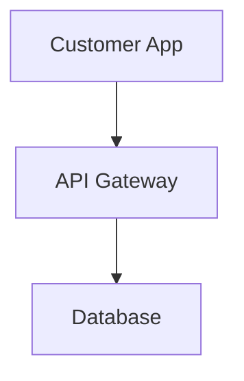

# Documentation Style Guide

This guide ensures consistency and quality across all Qatar Car Wash Platform documentation.

## 🎯 Writing Principles

### Clarity First
- **Simple language**: Avoid jargon, explain technical terms
- **Active voice**: "The system processes payments" vs "Payments are processed"
- **Concrete examples**: Show real Qatar use cases
- **Logical flow**: Structure information hierarchically

### Qatar Market Focus
- **Local context**: Reference Qatar business practices
- **Cultural awareness**: Respect Islamic customs and timing
- **Practical examples**: Use Doha locations, QAR pricing
- **Business relevance**: Connect to local market needs

## 📝 Content Standards

### Headings Structure
```markdown
# Document Title (H1 - once per page)
## Major Section (H2)
### Subsection (H3)
#### Detail Section (H4)
##### Minor Point (H5 - rarely used)
```

### Writing Style
- **Tone**: Professional, approachable, confident
- **Person**: Second person for instructions ("You can...")
- **Tense**: Present tense for current features, future for roadmap
- **Numbers**: Spell out one through nine, use numerals for 10+

### Qatar-Specific Guidelines

#### Currency and Numbers
- **Primary**: QAR 150 (always show Qatari Riyal first)
- **Secondary**: QAR 150 ($40 USD) (if needed)
- **Formatting**: Use comma separators for thousands: QAR 1,500

#### Geographic References
- **Locations**: Doha, West Bay, Pearl Qatar, Al Rayyan
- **Coverage**: "Greater Doha area", "Qatar metro region"
- **Distances**: Use kilometers (25km radius, not miles)

#### Cultural Elements
- **Prayer times**: Automatic prayer time integration
- **Weekend**: Friday-Saturday weekend pattern
- **Holidays**: Eid, National Day, Ramadan considerations
- **Business hours**: Respect cultural timing preferences

#### Language Considerations
- **Arabic support**: Mention RTL (right-to-left) requirements
- **Bilingual**: English primary, Arabic secondary
- **Local terms**: Use Qatar-specific business terminology

## 🔧 Technical Writing

### Code Examples
```markdown
```python
# Always include language specification
def process_booking():
    return "Qatar booking processed"
```
```

### API References
- **Method**: `GET /api/providers`
- **Parameters**: Include required/optional status
- **Response**: Show example JSON
- **Status codes**: List possible HTTP responses

### Architecture Diagrams
Use Mermaid syntax for consistency:
```markdown

```

## 📊 Content Types

### Requirements Documentation
- **Format**: "The system SHALL/SHOULD/MAY..."
- **Numbering**: FR1.1, NFR2.3 (Functional/Non-Functional Requirements)
- **Testing**: Include acceptance criteria
- **Priority**: Must-have, Should-have, Could-have

### User Stories
- **Format**: "As a [role], I want [goal] so that [benefit]"
- **Qatar context**: Include cultural considerations
- **Acceptance criteria**: Specific, measurable conditions
- **Examples**: Real Qatar car wash scenarios

### Business Documentation
- **Metrics**: Include baselines and targets
- **Market data**: Qatar-specific statistics
- **Financials**: QAR currency, local market sizing
- **Compliance**: Qatar regulatory requirements

## 🎨 Visual Elements

### Images and Screenshots
- **Alt text**: Descriptive alternative text required
- **Qatar branding**: Use appropriate colors and imagery
- **Mobile-first**: Show mobile interfaces prominently
- **Accessibility**: High contrast, readable fonts

### Tables
| Column 1 | Column 2 | Column 3 |
|----------|----------|----------|
| Data     | Data     | Data     |

- **Headers**: Bold and descriptive
- **Alignment**: Left for text, right for numbers
- **Qatar data**: Use local examples and currency

### Lists and Formatting

#### Ordered Lists (for sequential steps)
1. First step in Qatar car wash booking
2. Second step with prayer time consideration
3. Third step with QAR payment processing

#### Unordered Lists (for features or options)
- Qatar National Bank integration
- Islamic banking compliance
- Arabic RTL interface support

#### Emphasis
- **Bold**: For important terms and Qatar-specific features
- *Italic*: For emphasis and Arabic terminology
- `Code`: For technical terms and API endpoints

## 🌍 Internationalization

### Arabic Support Planning
- **Text direction**: Plan for RTL layout requirements
- **Font consideration**: Arabic script compatibility
- **Cultural imagery**: Appropriate visual representations
- **Translation notes**: Mark content for Arabic translation

### English Standards
- **Spelling**: US English (color, not colour)
- **Grammar**: Oxford comma usage
- **Technical terms**: Consistent across all documents

## ✅ Quality Checklist

Before submitting documentation:

### Content Review
- [ ] Qatar market relevance verified
- [ ] Cultural considerations included
- [ ] Technical accuracy confirmed
- [ ] Examples use local context

### Format Review
- [ ] Headings follow hierarchy
- [ ] Links work correctly
- [ ] Code blocks have language specified
- [ ] Tables format properly
- [ ] Images have alt text

### Style Review
- [ ] Consistent terminology used
- [ ] QAR currency shown first
- [ ] Qatar locations referenced
- [ ] Professional tone maintained

### Accessibility Review
- [ ] Clear heading structure
- [ ] Descriptive link text
- [ ] Alt text for images
- [ ] Color not sole information carrier

## 📚 Resources

### Qatar Business References
- Qatar Chamber of Commerce
- Qatar Central Bank regulations
- Qatar National Vision 2030
- Digital Government initiatives

### Technical References
- [MkDocs](https://www.mkdocs.org/)
- [Material Theme](https://squidfunk.github.io/mkdocs-material/)
- [Mermaid Diagrams](https://mermaid.js.org/)
- [Markdown Guide](https://www.markdownguide.org/)

### Style References
- [Google Developer Documentation Style Guide](https://developers.google.com/style)
- [Microsoft Writing Style Guide](https://docs.microsoft.com/en-us/style-guide/)

---

*Remember: This documentation represents Qatar's premier car wash platform. Quality and cultural sensitivity are paramount.*