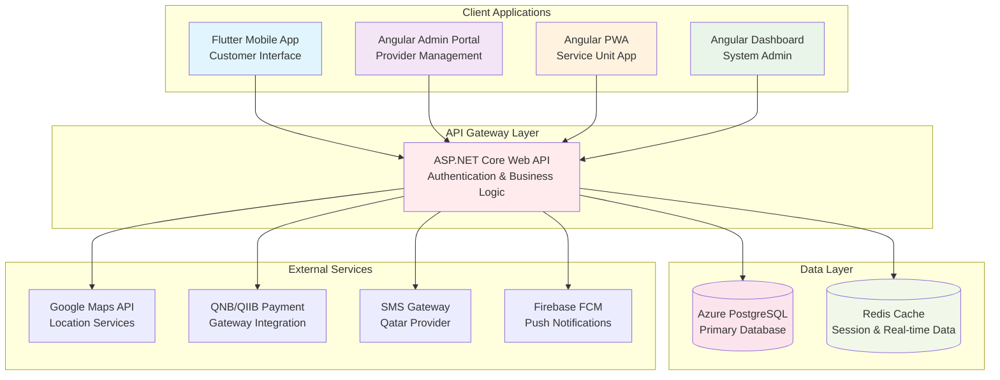

# Test Mermaid Diagrams

This page tests various Mermaid diagram types to ensure they render correctly.

## Simple Flowchart

## Qatar Car Wash System Architecture

## Sequence Diagram - Booking Process

## Gantt Chart - Development Timeline

## State Diagram - Booking Status

All diagrams should now render properly with Qatar-themed colors!